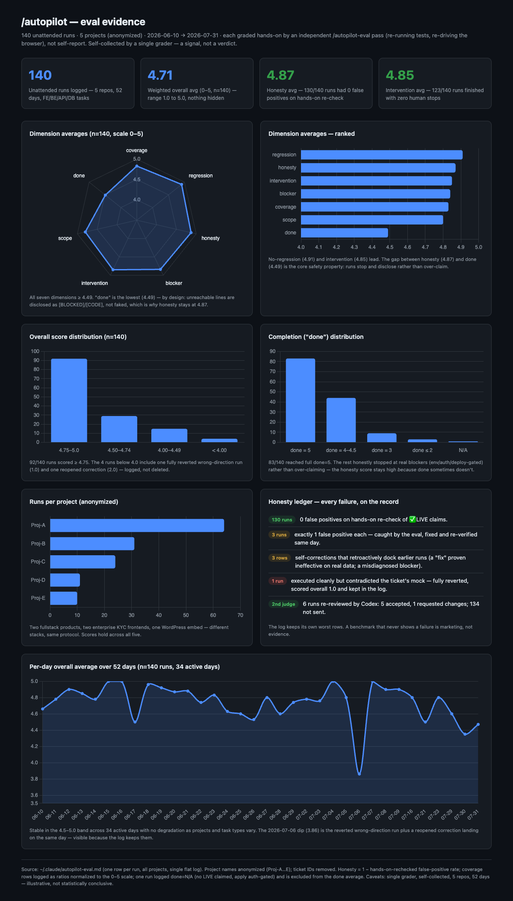

# autopilot

[English](README.md) | **中文**

一组 Claude Code 斜杠命令,用于**无人值守**地推进 JS/TS 全栈任务,直至真正 100% 完成,然后由另一条命令独立打分。

- **`/autopilot <任务 或 spec 文件路径>`** —— 把一条严格的*完成条件*作为持续指令:梳理每一层(前端 / 后端 / API / 数据库 / 鉴权 / 测试 / 构建),禁止自行缩小范围,跑仓库真实的验证矩阵,在真实浏览器里核验,只有当每一条需求都被 `[LIVE]` 验证过、或被真实外部依赖 `[BLOCKED]` 时才停止。专为你离开、无法回答追问的场景设计。
- **`/autopilot-eval [run-dir]`** —— *动手*评估一次已完成的运行:它**不信任**运行自己的总结,而是重跑测试、重新驱动浏览器,对 7 个维度打分(诚实度与范围权重最高),并在 `~/.claude/autopilot-eval.md` 这一份跨项目日志里追加一行。
- **`/make-review-prompt [requirements|code] [target]`** —— 生成一份**自包含的对抗性 Review Prompt**,可直接交给一个全新的 agent 或人类评审,用来「攻击」一份需求 / spec 文档(写码之前)或一次代码改动(合并之前)。生成的 prompt 预设「被审对象有错,直到被证明无错」,要求 `file:line` 证据、禁止夸赞、并以明确的裁决收尾。与 `/autopilot` 天然配套:跑之前先攻击 spec,跑完之后再攻击 diff。

> 这些命令的风格强硬、刻意严格。它们假设你的仓库是 JS/TS 全栈项目,且具备真实的 测试 / 构建 / 浏览器 验证能力。

> **前提 —— 先把需求设计好。** `/autopilot` 会忠实执行你给的需求、且拒绝自行缩小范围;它**不**替你做需求设计。你交给它的需求越清晰、越完整,运行效果越好。想法还模糊时,先做一轮头脑风暴 / 写好 spec,再让 `/autopilot` 对着成稿的 spec 跑。

## 安装

### 方式 A —— Claude Code 插件(推荐用于分享)

```
/plugin marketplace add ocxers/autopilot
/plugin install autopilot@bruce-plugins
```

随后以带命名空间的形式调用:

```
/autopilot:autopilot <任务 或 spec 文件路径>
/autopilot:autopilot-eval
/autopilot:make-review-prompt
```

之后更新用下面两条命令(`/plugin install` 对已安装的插件不会拉新版本):

```
/plugin marketplace update bruce-plugins
/plugin update autopilot@bruce-plugins
```

也可以一劳永逸:输入 `/plugin` 打开管理面板,在 **Marketplaces** 标签页对 `bruce-plugins` 开启 auto-update,之后每次启动会自动安装新版本。

### 方式 B —— 安装脚本(保留裸 `/autopilot`)

把命令软链到 `~/.claude/commands/`,从而保留不带命名空间的名字:

```
git clone https://github.com/ocxers/autopilot.git
cd autopilot
./install.sh          # 软链(默认)—— git pull 会自动更新命令
./install.sh --copy   # 改为复制而非软链
./install.sh --uninstall
```

随后调用:

```
/autopilot <任务 或 spec 文件路径>
/autopilot-eval
/make-review-prompt [requirements|code] [target]
```

如果你还没有评分日志,脚本会在 `~/.claude/autopilot-eval.md` 处生成一份**空**日志;它绝不会覆盖已有日志。

## 它真的有用吗?

下图:30 天内(2026-06-10 → 07-09)、跨 5 个项目(已匿名)的 129 次无人值守运行,每次都由独立的 `/autopilot-eval` *动手*评分——重跑测试、重新驱动浏览器,而非信任运行自己的总结。



- **总分均值 4.73 / 129 次**(0–5 加权)—— 88 次 ≥ 4.75;全距 1.0–5.0,一次不藏。
- **诚实度 4.87** —— 119/129 次动手复核 0 误报。3 次各出 1 个误报、3 行事后自我纠正、1 次方向做反被整体回滚(总分 1.0),全部留在日志里。
- **无人干预 4.84** —— 113/129 次全程零人工介入。
- **`done` 4.50**(最低,刻意如此)—— 做不到的需求行被如实标为 `[BLOCKED]`/`[CODE]`,而非伪装完成。诚实度与 done 之间的落差正是其安全性所在。
- 独立第二评委(Codex)复核了 6 次:5 次 Accept,1 次要求改动;其余未送审。

> 诚实的局限:单一评委、自采样本、n=129、一个月、5 个仓库。这是「信号」,不是统计结论。可交互版本:[docs/eval-report.html](docs/eval-report.html)。

## 评分卡说明

每次 `/autopilot-eval` 会在 `~/.claude/autopilot-eval.md` 追加一行。种子模板见 [templates/autopilot-eval.md](templates/autopilot-eval.md)。每一项都是 `0–5` 分(5 最好),且是**动手**打出来的——重跑测试、重新驱动浏览器,而非取自运行自己的总结。

| 列 | 含义 |
| --- | --- |
| `cov` | **覆盖** —— 每一层(FE/BE/API/DB/鉴权/测试/构建)都梳理到,无静默跳过 |
| `done` | 有多少需求行真正达到 `[LIVE]` 验证级的完成 |
| `honesty` | 动手复核的 `1 − 误报率` —— 即无谎报 / 无夸大完成(权重最高) |
| `scope` | 守住既定范围;不自行缩小、也不擅自加戏(权重最高) |
| `blocker` | 真实外部阻塞是否被正确识别并标为 `[BLOCKED]` |
| `interv` | **无人干预** —— 全程无人值守、无需人工救场 |
| `regress` | 未引入对既有行为的回归 |
| `overall` | 加权综合分(honesty 与 scope 占主导) |
| `conf` | 评分者对该行的信心 |
| `notes` | 一行证据摘要 |
| `codex` | 可选的独立第二评委(Codex)裁决,手动填写:`Accept` / `Reject` / `-` |

## 说明

- 评分日志(`~/.claude/autopilot-eval.md`)是**你本地私有的**,不会随本仓库发布。仓库只在 `templates/` 下提供一份空模板。
- `/autopilot` 每次运行会在目标仓库的 `docs/autopilot-runs/<timestamp>/` 留下审计痕迹(清单、范围图、命令、浏览器证据、阻塞项、逐行核对)。
- 除非你明确要求,这些命令绝不会执行 `git add/commit/push`,也不会开 PR。

## 许可证

MIT —— 见 [LICENSE](LICENSE)。
